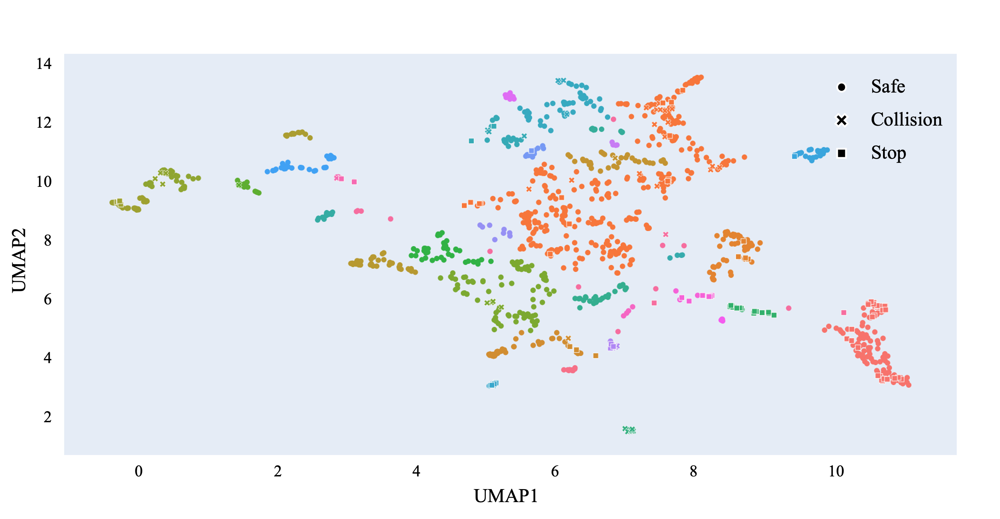

# \[AutoSVT\] Search-based Scenario Generation Algorithm 
This project is a search-based algorithm designed to generate safety-critical scenarios in the CARLA simulator, ultimately identifying diverse corner cases (i.e., collisions and unexpected stops) for autonomous driving systems. Additionally, the project employs UMAP for dimensionality reduction and visualization of scenarios, enabling an intuitive analysis of scenario diversity.

Please visit [AutoSVT](https://idslab-autosec.github.io/) to view videos and descriptions of the corner cases.

## Installation
1. Install the AutoSVT-Carla Python package. Please refer to [AutoSVT-Bridge](https://github.com/idslab-autosec/AutoSVT-Carla-Apollo-Bridge) for instructions.
2. Install python packages.
    ```bash
    pip install -r requirements.txt 
    ```


## Getting Started
Run CARLA, Apollo and bridge. For detailed steps, please refer to [AutoSVT-Bridge](https://github.com/idslab-autosec/AutoSVT-Carla-Apollo-Bridge).

### Scenario generation
You can use `main.py` to generate scenarios, and for information on the relevant parameters, please check `main.py -h`.

```bash
python main.py -s 10 -n 100 -o output
```

After running `main.py`, the discovered corner cases will be stored in JSON format in the `output/` directory, which includes scenario information.

### Corner cases reproduction
The corner cases we've already found are stored in `corner_case/`, and you can reproduce these corner cases using `replay.py`.

```bash
python replay.py [FILE]
```

### Scenario Visualization
You can use `cluster.py` to perform dimensionality reduction and visualization of scenario records. We applied the DBSCAN algorithm to cluster the scenarios .
```bash
python cluster.py -d output
```



## Acknowledgments
This project is based on the framework of [DriveFuzz](https://gitlab.com/s3lab-code/public/drivefuzz).